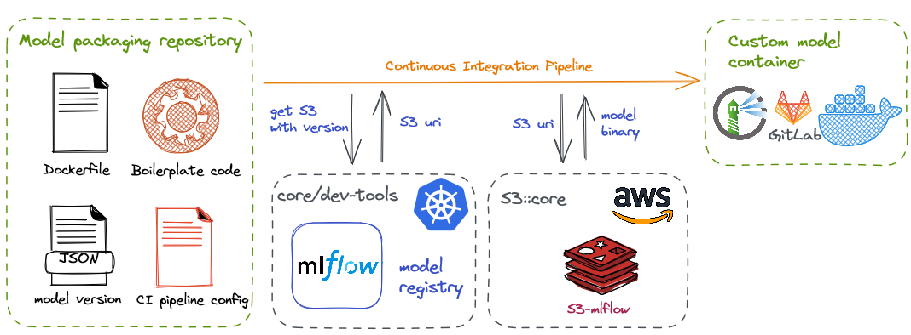
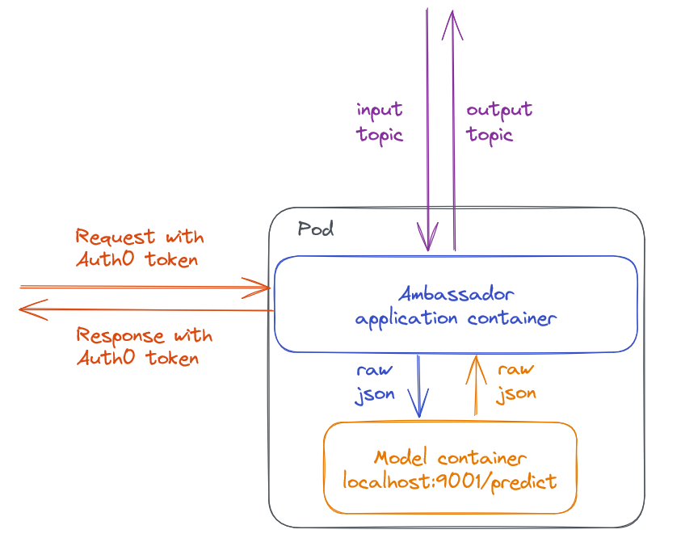
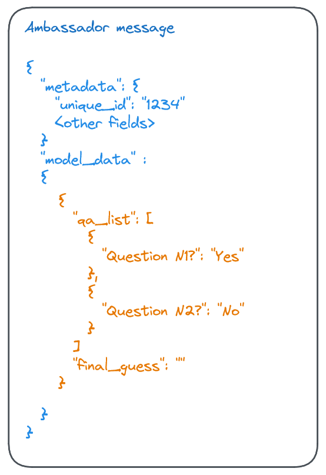
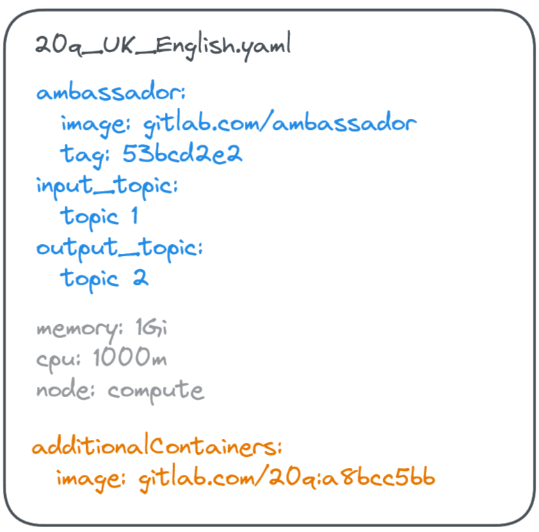
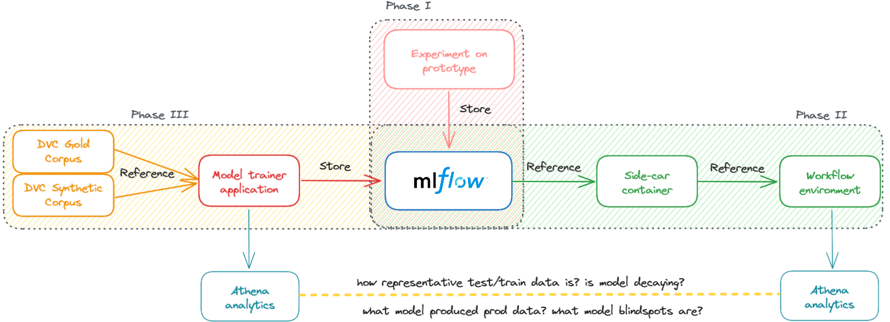
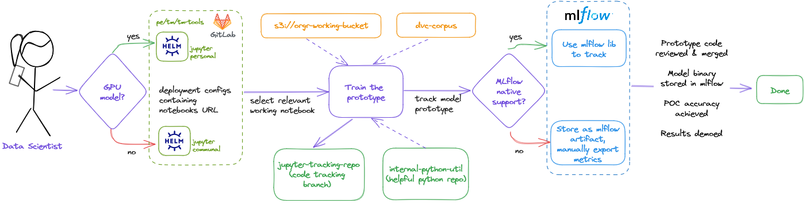
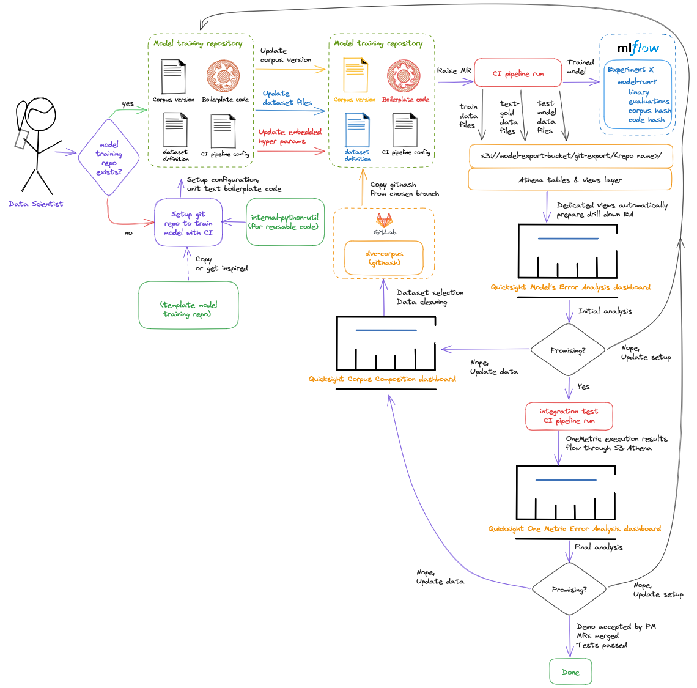
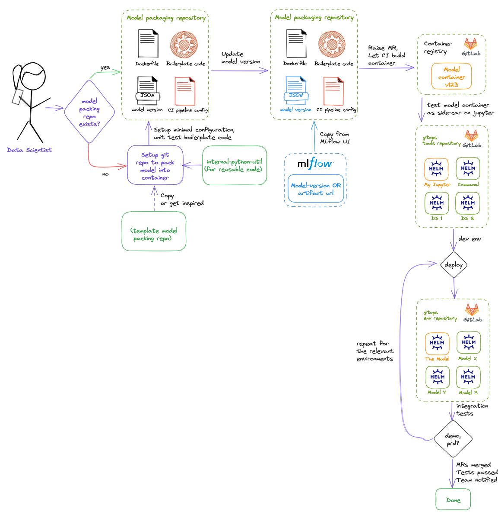

# Twenty Questions Application
Mock of the ML-based application using `model` to answer 20 questions and guess the noun chosen by the user.
Repository primarily serves as the CI-pipeline based `docker` assembly, taking the model from model registry (like mlflow)
embedding it into container with a simple rest endpoint. Of course while validating that the glue code is tested and coverage is acceptable.

The README also provides an overview how this repository fits into the wider MLops processes.

## Overview


It is assumed that model files are stored in model registry like `mlflow`, `weights & biases`, `neptune` or similar.
Model version is specified in `mlflow/model_version.json` in the repository assembling the container -- providing a direct accountability between the model container and the model embedded into it.
There is a python code executing this model and unit tests / coverage tools for this code.
There is a CI pipeline definition (gitlab in this case), which orchestrates the integration process.
Finally, there is a `Dockerfile`, which is used to assemble a container with model binary and python boilerplate code inside.

### Working with code
Before running the code, please install dependencies:
```
pip install -r requirements.txt
```

To run tests with coverage:
```
python -m pytest -o log_cli=true -v --junitxml=report.xml --cov-report xml:coverage.xml --cov-report term --cov app tests/
```
coverage report will appear on local machine and the output will also appear in console.

## Hosting and calling the model
### Ambassador hosting pattern


Python is not famous for its tough security, but we do want to provide data scientists with freedom of choosing frameworks they like.

The Kubernetes Ambassador hosting pattern is one of the answers to that dilemma.
It assumes a two-tier application, where the primary container is written in high-security language and is exposed to the outside.
The second tier is a container with the model itself, visible only on localhost and having an insecure REST endpoint.
The ambassador application authorises the request to pass to the model container and routes the answer back by calling this endpoint on localhost.



The two-tier nature can be reflected in the message as well -- for instance the ambassador application can copy metadata
from input to output message, so that model container has even more focused responsibility.

### Deployment


The deployment process coming naturally with the pattern is `gitops`, or simply a dedicated git repository's `main` branch
is synchronised with Kubernetes' control plane.
Merges to `main` trigger redeployment to the environment.
The data scientist-driven deployment process can be implemented as follows:
* There is a Continuous Integration pipeline which builds model container (this repo can be seen as an example of it)
* There is a separate `gitops` repo with yaml files like in the screenshot above
* Data scientist copies the tag of the freshly built model container and creates a branch in `gitops` gitops repo with `additionalContainer` field updated
* Upon approval and merge, the fresh model container is safely hosted

### Cloud services which can be used
The downside of this solution is that it requires Kubernetes clusters to work. 
In AWS it is EKS, in GCP it is GKE and of course there many other ways to host Kubernetes.
For model-on-demand (warm) hosting, queues like SQS (AWS), PubSub (GCP) can be used.
For hot serving, REST API or queues in streaming setup (might be above, or also Kinesis/Kafka) might be utilised as well

### Monitoring
The infrastructure/application-levels monitoring can be implemented using the standard Kubernetes stack (Prometheus, Thanos, Grafana).
With "a little bit of setup" logs would appear separately for ambassador and model applications, the alerting can be set just as well.

#### Model decay monitoring
The primary idea behind the model decay monitoring is to provide some visibility on data drift seen in production.
Unlike application monitoring, the model has know way to know that the drift is happening and additional layer of tooling is needed to detect it.

The proposed solution to model decay monitoring is to export model outputs on the ambassador level.
A BI dashboard then can be created, which would compare train/test data against the production data.
Depending on model type, it can simply show a statistical significance graph with the alert threshold -- or it can highlight the drift itself (like new tokens for NLP models).

## Data Science developer stories


In this section we provide an overview for the common "from prototype to production" path of model development. Please see [ml-ops.org](https://ml-ops.org/content/end-to-end-ml-workflow) for more context and detail.
Here we divide work into three stages:
* Developing a prototype binary which is believed to be reasonable (work is done in Kubernetes cluster, model binary is stored in model registry)
* Setup of a container-builder repository, model execution boilerplate code and the first deployment to staging environment
* Setup of the retraining repository -- with unit tested training code, tracked reference to DVC corpus repository and CI pipeline building/evaluating model(s) on completion 

### Building model prototype


Note: GPU/TPU or other special jupyter notebooks can be provisioned in ways of the organisation and funds available to it. With gitops, individual users have enough autonomy to select nodes to run experiments on -- things become even easier if there is a dedicated Jupyter cluster.

### Training model(s)


Note 1: depending on the scale in AWS Redshift might be used instead of Athena; in GCP BigQuery is the prime tool for that kind of problem.

Note 2: in this diagram it is assumed that the model is hosted as a part of a more complex project (like NLP), therefore there is a second layer checking for the E2E evaluation called here One Metric - the layer usually makes sense when outputs given to users differ from those of model in not-easy-to-deduce way.

Note 3: Corpus Composition dashboard is set in the same data export fashion but on the DVC repository CI pipeline. Its primary use case is data awareness/cleaning. It is useful for cases of data drift in the corpus itself -- to prevent retraining/testing on data not encountered in production.

### Building container 


Note: current repository serves as an example.


